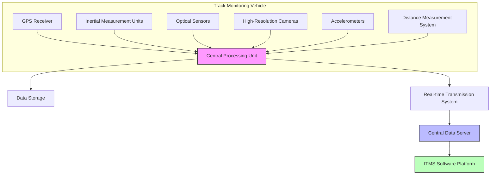
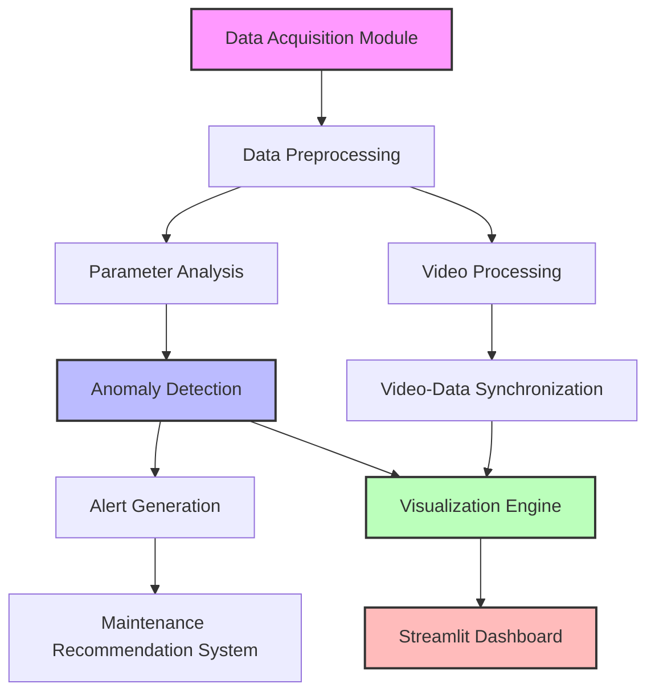
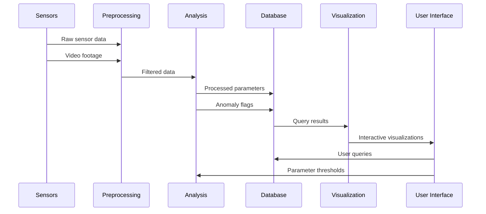
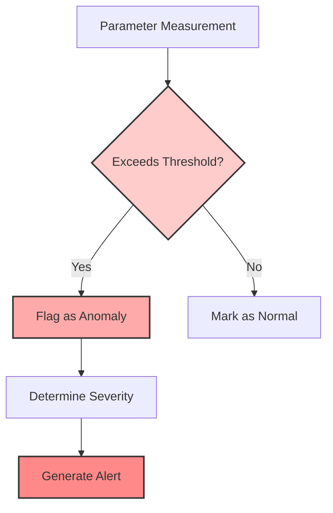
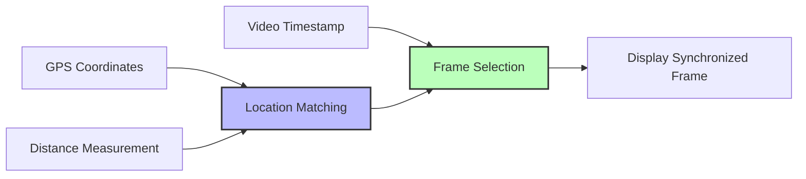

# Indian Railways Integrated Track Monitoring System (ITMS)

<div align="center">
  
  <h3>A Comprehensive Track Monitoring and Analysis Solution</h3>
</div>

## Table of Contents
- [Overview](#overview)
- [System Architecture](#system-architecture)
  - [Hardware Components](#hardware-components)
  - [Software Components](#software-components)
  - [Data Flow](#data-flow)
- [Features](#features)
- [Installation and Setup](#installation-and-setup)
- [Usage Guide](#usage-guide)
- [Technical Details](#technical-details)
  - [Track Parameter Analysis](#track-parameter-analysis)
  - [Anomaly Detection](#anomaly-detection)
  - [Video Synchronization](#video-synchronization)
- [Development Roadmap](#development-roadmap)
- [Smart India Hackathon Context](#smart-india-hackathon-context)
- [Contributing](#contributing)
- [License](#license)

## Overview

The Indian Railways Integrated Track Monitoring System (ITMS) is a comprehensive solution designed to monitor, analyze, and visualize railway track conditions in real-time. This system combines advanced sensor technology, data processing algorithms, and an intuitive user interface to provide actionable insights for railway maintenance teams.

By continuously monitoring critical track parameters such as gauge, alignment, twist, and cross-level, ITMS helps identify potential issues before they lead to safety hazards or service disruptions. The system also incorporates visual inspection through synchronized video footage, allowing for detailed examination of track segments flagged for attention.

This prototype demonstrates the core functionality of the ITMS, providing a foundation that can be expanded into a full-scale deployment across the Indian Railways network.

## System Architecture

### Hardware Components



The hardware system consists of:

1. **Track Monitoring Vehicle**: A specialized vehicle equipped with:
   - **GPS Receiver**: For precise location tracking
   - **Inertial Measurement Units (IMUs)**: To measure track geometry parameters
   - **Optical Sensors**: For rail profile measurement
   - **High-Resolution Cameras**: For visual inspection and recording
   - **Accelerometers**: To measure vertical and lateral accelerations
   - **Distance Measurement System**: For accurate chainage recording

2. **Data Storage and Transmission**:
   - Onboard storage for raw data
   - Real-time transmission system for immediate analysis
   - Central data server for long-term storage and processing

### Software Components



The software architecture includes:

1. **Data Acquisition Module**: Interfaces with hardware sensors to collect raw data
2. **Data Preprocessing**: Cleans and filters raw data to remove noise and artifacts
3. **Parameter Analysis**: Calculates track geometry parameters and compares with standards
4. **Video Processing**: Processes video footage for synchronization with parameter data
5. **Anomaly Detection**: Identifies deviations from normal track conditions
6. **Video-Data Synchronization**: Links parameter readings with corresponding video frames
7. **Alert Generation**: Creates alerts for maintenance teams based on severity
8. **Visualization Engine**: Prepares data for interactive visualization
9. **Streamlit Dashboard**: User interface for data exploration and analysis
10. **Maintenance Recommendation System**: Suggests maintenance actions based on detected issues

### Data Flow



The data flows through the system as follows:

1. Sensors collect raw data from the track
2. Preprocessing filters and cleans the data
3. Analysis module calculates parameters and identifies anomalies
4. Results are stored in the database
5. Visualization engine queries the database and prepares visualizations
6. User interface displays the visualizations and allows for interaction
7. User can adjust parameters and query specific data points

## Features

### Track Parameter Monitoring

- **Gauge Measurement**: Monitors the distance between rails
- **Alignment Analysis**: Tracks lateral deviations in track position
- **Twist Calculation**: Measures the rate of change in cross level
- **Cross Level Monitoring**: Tracks height difference between rails
- **Acceleration Measurement**: Records vertical and lateral accelerations

### Advanced Analytics

- **Threshold-based Anomaly Detection**: Flags parameters exceeding safety limits
- **Trend Analysis**: Tracks parameter changes over time
- **Hotspot Identification**: Highlights recurring problem areas
- **Maintenance Prioritization**: Ranks issues by severity and impact

### Interactive Visualization

- **Parameter vs. Chainage Plots**: Visual representation of track conditions
- **Anomaly Highlighting**: Clear marking of problematic areas
- **Video Synchronization**: View track footage corresponding to data points
- **Filtering and Zooming**: Focus on specific parameters or track sections

### Reporting and Export

- **Automated Reports**: Generate summaries of track conditions
- **Data Export**: Download processed data for offline analysis
- **Maintenance Work Orders**: Create detailed instructions for repair teams

## Installation and Setup

### Prerequisites

- Python 3.8 or higher
- Pip package manager
- Git (optional, for version control)

### Dependencies

The system requires the following Python packages:

```
streamlit==1.22.0
pandas==2.0.0
numpy==1.24.3
matplotlib==3.7.1
plotly==5.14.1
scipy==1.10.1
```

### Installation Steps

1. Clone the repository or download the source code:
   ```bash
   git clone https://github.com/yourusername/indian-railways-itms.git
   cd indian-railways-itms
   ```

2. Install the required dependencies:
   ```bash
   pip install -r requirements.txt
   ```

3. Prepare your data:
   - Place your track parameter CSV file in the root directory
   - Organize track footage in appropriate directories

4. Run the application:
   ```bash
   streamlit run app.py
   ```

## Usage Guide

### Main Dashboard

1. **Data Loading**:
   - Use the sidebar to upload your CSV data file
   - Alternatively, use the provided sample data

2. **Data Preprocessing**:
   - Select preprocessing options (missing value handling, filtering)
   - Choose filter type and parameters

3. **Analysis**:
   - View track parameters across different tabs
   - Identify flagged segments exceeding thresholds
   - Explore correlations between parameters

4. **Chainage Selection**:
   - Use the slider to focus on specific track sections
   - View detailed parameters for selected chainages

### Video Sync Page

1. **Chainage Selection**:
   - Select a specific chainage point
   - View corresponding track footage

2. **Parameter Display**:
   - See real-time parameter values at selected chainage
   - View parameter trends around the selected point

3. **Auto-Advance**:
   - Enable auto-advance to simulate moving along the track
   - Adjust speed to control the simulation rate

### Explanation Page

- Learn about track monitoring concepts
- Understand parameter definitions and significance
- Explore analysis methods and standards

## Technical Details

### Track Parameter Analysis

#### Gauge Deviation Calculation

The gauge deviation is calculated as the difference between the measured gauge and the nominal gauge (typically 1435mm for standard gauge):

```python
gauge_deviation = measured_gauge - NOMINAL_GAUGE
```

Deviations beyond ±5mm are flagged for attention.

#### Alignment Error

Alignment error is calculated from the left and right rail measurements:

```python
alignment_total = sqrt(alignment_left^2 + alignment_right^2)
```

Values exceeding 10mm are considered problematic.

#### Twist Calculation

Twist is measured as the rate of change of cross level over a specified distance. Values over 5mm/m require attention.

### Anomaly Detection

The system uses threshold-based anomaly detection for each parameter:



Thresholds are based on industry standards:

| Parameter | Alert Limit | Intervention Limit | Immediate Action Limit |
|-----------|------------|-------------------|------------------------|
| Gauge Deviation | ±3 mm | ±5 mm | ±10 mm |
| Alignment | 8 mm | 10 mm | 16 mm |
| Twist | 3 mm/m | 5 mm/m | 7 mm/m |
| Cross Level | 5 mm | 7 mm | 12 mm |
| Vertical Acceleration | 0.35g | 0.5g | 0.7g |
| Lateral Acceleration | 0.25g | 0.35g | 0.5g |

### Video Synchronization

Video synchronization is achieved through GPS coordinates and distance measurements:



Each video frame is tagged with:
- GPS coordinates
- Distance from reference point
- Timestamp

This allows for precise matching between parameter readings and video frames.

## Development Roadmap

### Phase 1: Prototype (Current)
- Basic parameter monitoring
- Simple anomaly detection
- Video synchronization prototype
- Streamlit dashboard

### Phase 2: Enhanced Analytics
- Machine learning-based anomaly detection
- Predictive maintenance algorithms
- Historical trend analysis
- Advanced filtering options

### Phase 3: Enterprise Integration
- Integration with Indian Railways maintenance systems
- Mobile application for field teams
- Real-time alerts and notifications
- Automated maintenance scheduling

### Phase 4: Network-Wide Deployment
- Multi-vehicle data integration
- Network-level analytics
- Strategic maintenance planning
- Performance optimization

## Smart India Hackathon Context

This project aligns perfectly with the Smart India Hackathon's focus on leveraging technology to solve real-world problems in India's infrastructure. The Indian Railways network is one of the largest in the world, and maintaining its vast track infrastructure is a significant challenge.

### Potential Impact

- **Safety Enhancement**: Early detection of track defects can prevent derailments and accidents
- **Maintenance Optimization**: Data-driven maintenance reduces costs and improves efficiency
- **Service Reliability**: Better track conditions lead to fewer delays and service disruptions
- **Resource Allocation**: Prioritize maintenance based on actual track conditions

### Implementation Considerations

- **Scalability**: Design for deployment across the entire Indian Railways network
- **Ruggedness**: Hardware must withstand harsh environmental conditions
- **Connectivity**: Consider areas with limited network coverage
- **Integration**: Work with existing Indian Railways systems and processes

### Next Steps for Hackathon Participants

1. **Hardware Prototyping**: Develop low-cost sensor packages for track monitoring
2. **Algorithm Refinement**: Improve anomaly detection and parameter calculation
3. **UI/UX Enhancement**: Make the interface more intuitive for railway staff
4. **Field Testing**: Validate the system under real-world conditions
5. **Deployment Planning**: Create a phased rollout strategy

## Contributing

We welcome contributions to the ITMS project! Here's how you can help:

1. **Code Contributions**: Improve algorithms, add features, fix bugs
2. **Documentation**: Enhance explanations, add examples, translate content
3. **Testing**: Validate functionality, report issues, suggest improvements
4. **Domain Expertise**: Share railway engineering knowledge and best practices

Please follow our contribution guidelines when submitting changes.

## License

This project is licensed under the MIT License - see the LICENSE file for details.

---

<div align="center">
  <h3>Best of luck to all Smart India Hackathon participants!</h3>
  <p>Your innovative solutions have the potential to transform India's railway infrastructure and improve the lives of millions of passengers. We believe in your creativity, technical skills, and determination to make a difference.</p>
  <p>May your code be bug-free and your ideas revolutionary!</p>
</div>