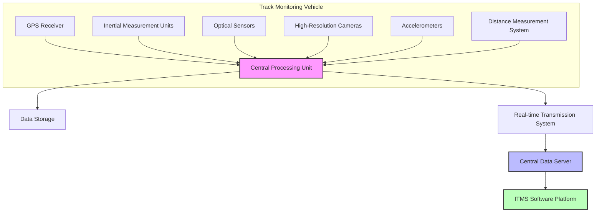
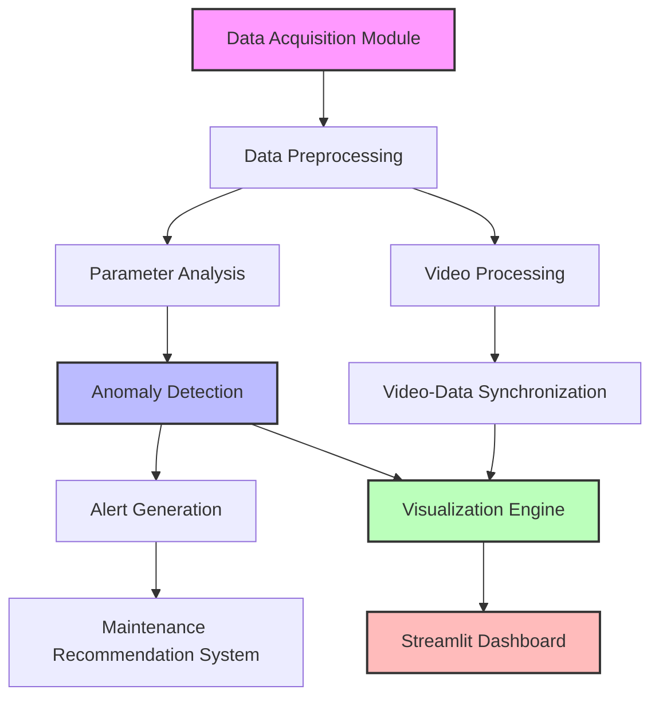
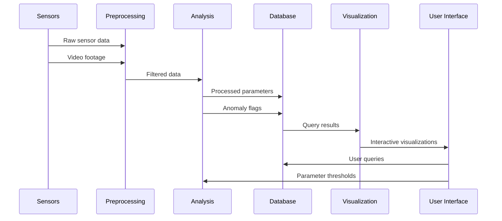

# 🚆 Indian Railways Integrated Track Monitoring System (ITMS)

<div align="center">
  
  <h3>A Comprehensive Track Monitoring and Analysis Solution</h3>
</div>

## 📋 Table of Contents
- [Overview](#-overview)
- [System Architecture](#-system-architecture)
- [Features](#-features)
- [Installation](#%EF%B8%8F-installation)
- [Usage](#%EF%B8%8F-usage)
- [Smart India Hackathon Context](#-smart-india-hackathon-context)

## 🔍 Overview

The Indian Railways Integrated Track Monitoring System (ITMS) is a comprehensive solution designed to monitor, analyze, and visualize railway track conditions in real-time. This system combines advanced sensor technology, data processing algorithms, and an intuitive user interface to provide actionable insights for railway maintenance teams.

## 🏗️ System Architecture

### Hardware Components

Below is the Mermaid diagram code showing the hardware architecture:



### Software Components

Below is the Mermaid diagram code showing the software architecture:



### Data Flow

Below is the Mermaid diagram code showing the data flow:



## ✨ Features

- 🔧 **Track Parameter Monitoring**: 
  - Gauge, alignment, twist, cross level, unevenness
  - Acceleration measurements (vertical and lateral)
  - Rail profile and wear

- 📊 **Advanced Analytics**: 
  - Anomaly detection based on thresholds
  - Trend analysis over distance
  - Hotspot identification for maintenance

- 📈 **Interactive Visualization**:
  - Parameter vs. chainage plots
  - Anomaly highlighting with red markers
  - Video synchronization with parameter data
  - Heatmap of parameter correlations

- 💾 **Reporting and Export**:
  - Data export in CSV and JSON formats
  - Flagged segments in tabular format

## ⚙️ Installation

1. Clone this repository
   ```bash
   git clone <repo-url>
   cd Indian-Railways-Track-Monitoring-System
   ```

2. Install the required packages:
   ```bash
   pip install -r requirements.txt
   ```

3. Run the application:
   ```bash
   streamlit run app.py
   ```

## ▶️ Usage

The application consists of multiple pages:

1. **Main Dashboard**: 
   - Upload data or use sample data
   - Apply preprocessing filters
   - View track parameter analysis
   - Identify flagged segments

2. **Video Sync Page**: 
   - View track footage synchronized with parameter data
   - See real-time parameter values at selected chainage
   - Auto-advance through the track with adjustable speed

3. **Explanation Page**: 
   - Learn about track monitoring concepts
   - Understand parameter definitions and significance

4. **Documentation Page**:
   - Access comprehensive system documentation
   - View architecture diagrams and data flow

## 🏆 Smart India Hackathon Context

This project aligns perfectly with the Smart India Hackathon's focus on leveraging technology to solve real-world problems in India's infrastructure. The potential impacts include:

- **Safety Enhancement**: Early detection of track defects to prevent accidents
- **Maintenance Optimization**: Data-driven maintenance planning
- **Service Reliability**: Fewer delays due to track issues
- **Resource Allocation**: Prioritize maintenance based on actual conditions

---

<div align="center">
  <h3>Best of luck to all Smart India Hackathon participants!</h3>
  <p>Your innovative solutions have the potential to transform India's railway infrastructure and improve the lives of millions of passengers.</p>
</div>

For more detailed information, please see the [COMPREHENSIVE_README.md](./COMPREHENSIVE_README.md) file.
